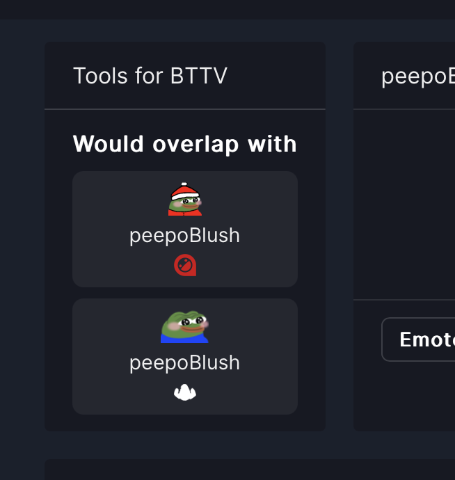

<div align="center">
    
    <h1>Tools for BTTV</h1>
</div>

> [!WARNING]  
> This browser extension is still under development and may have bugs and performance issues.

Tools for BTTV is a browser extension that provides additional features for emote management with BetterTTV and
FrankerFaceZ (support for 7tv is planned).
Current features:

- Duplicate emotes detection for channel dashboard and on emote pages (available on BTTV and FFZ)
- Emote usage data visible on dashboard and emote page (available on BTTV)
- Free-form notes and "do not remove" tags for emotes (available on BTTV)

These features will also be implemented for the other platforms. Planned features include:

- Seasonal / themed emote collections / variants with automated (one-click) replacement for the whole collection
- Notification (on-site) about deleted emotes
- Emote fallbacks for deleted emotes
- Categorize emote usage to check which bots are using which emotes

## Install

- **Chrome** and **Chrome-like browsers**  
  incl. Brave, Opera, Opera GX, Edge  
  https://chromewebstore.google.com/detail/tools-for-bttv-beta/lpdmpiigjiidppfebmoidccikbmkielg

- **Firefox**  
  ⚠️ Under review at time of writing, link will only work after approval  
  https://addons.mozilla.org/en-US/firefox/addon/tools-for-bttv-beta/

## Screenshots (Outdated)

<div align="center">
    
    
</div>
<div align="center">
    
    
</div>

## Develop / Review

### Prerequisites

- Nodejs with npm

### Build

First install the dependencies

```shell
npm i
```

Then build the files

```shell
npm run build
```

Package with

```shell
npm run pack-extension
```
