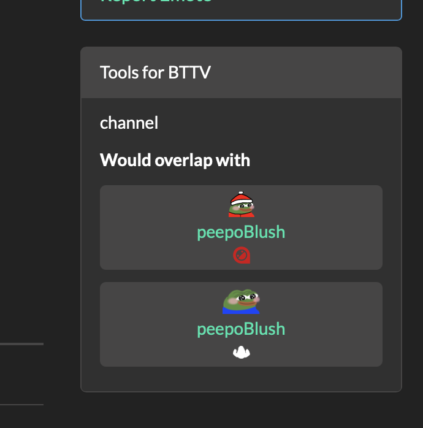

    
    <h1>Tools for BTTV</h1>

This userscript provides some tools for emote management with BetterTTV and FrankerFaceZ. In the current version it
shows you what emote names are duplicates (overlapping) within and across emote providers. It also shows emotes that are
likely duplicates, i.e. where the emote name is not an exact match like for "monkaHMM" and "monkaHmm".

## Install

You need a userscripts manager for your browser:

- For Chrome-like (Edge, Brave,
  Opera): [TamperMonkey](https://chrome.google.com/webstore/detail/tampermonkey/dhdgffkkebhmkfjojejmpbldmpobfkfo)
- For Firefox-like: [GreaseMonkey](https://addons.mozilla.org/firefox/addon/greasemonkey/)
- For Maxthon-like: [ViolentMonkey](https://extension.maxthon.com/detail/index.php?view_id=1680)
- For Safari-like [Userscripts](https://apps.apple.com/app/apple-store/id1463298887)

Then, go to
[the userscript for Tools for BTTV](https://cdn.jsdelivr.net/gh/brilliantdrink/tools-for-bttv/tools-for-bttv.user.js)
and click "Install". If your userscripts manager doesn't open when following this link, create a new userscript in your
manager and add the content of the userscript file manually.

## Screenshots

    
    

    
    

